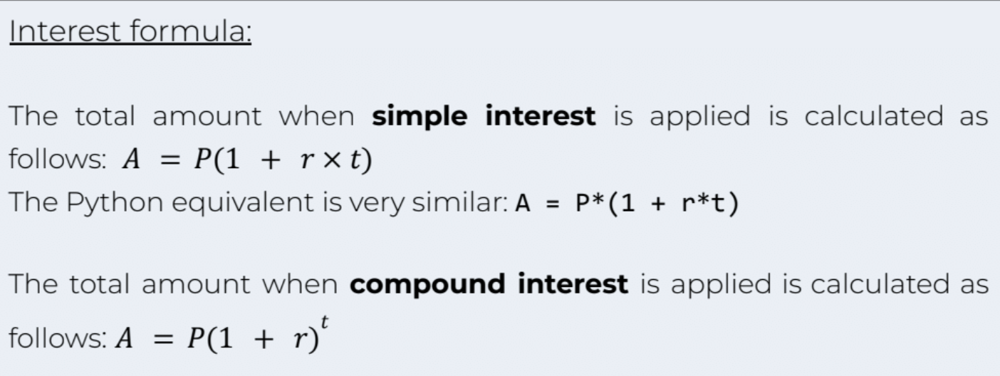
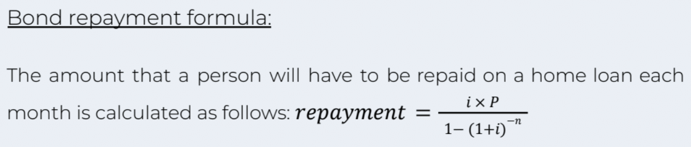

FINANCE CALCULATOR: Investment and Bond calculator
==================================

* * *

ABOUT THE PROGRAM:
------------------

* * * 

This _Finance Calculator_ program allows the user to calculate their interest on an investment or calculate the amount that should be repaid on a home loan each month.

## What are interests?
Interest occurs in almost all financial 'happenings, whether it be on a loan which ends up with you paying more to the bank, or on an investment which ends up with you earning more. There are two main types of interest: compound and simple interest.

### Simple interest:
_Simple interest_ is continually calculated on the initial amount invested and is only calculated once per year. This interest amount is then added to the amount that you initially invested (known as the principal amount).

An example of this is if you invest R1000 at 10%, the first year you will earn R100 interest (R1000 × 0.10) giving you R1100. The next year the interest is still calculated on the principal amount (R1000) giving you another R100, making a total of R1200.

### Compound interest:
_Compound interest_ is different in that the interest is calculated on the current total known as the accumulated amount.

To use the above example, imagine you invest R1000 at 10% compounded once a year. The first year you will earn R100, giving you an accumulated amount of R1100.
In the second year, you will earn interest on the accumulated amount (1100 × 0.10), to earn R110 interest, giving you R1210.

* * * 

PROGRAM FORMULAS:
-----------------

USER STORIES:
-------------

* * *

1.  User can choose the calculations they would like to do: investment or bond.
2.  When seleccting _investment_ user can input: amount depositing, interest rate, number of years investing, and wether to select simple or compound.
3.  When selecting _bond_ user can input: value of the house, interest rate, and number of months intended to repay the bond.

TARGET AUDIENCE:
----------------

* * *

*   Investors.
*   Home loan owners.
*   Loan and investor enthusiasts.
*   Ages 18+ 

## LANGUAGES:

* * *

*   Python

* * * 